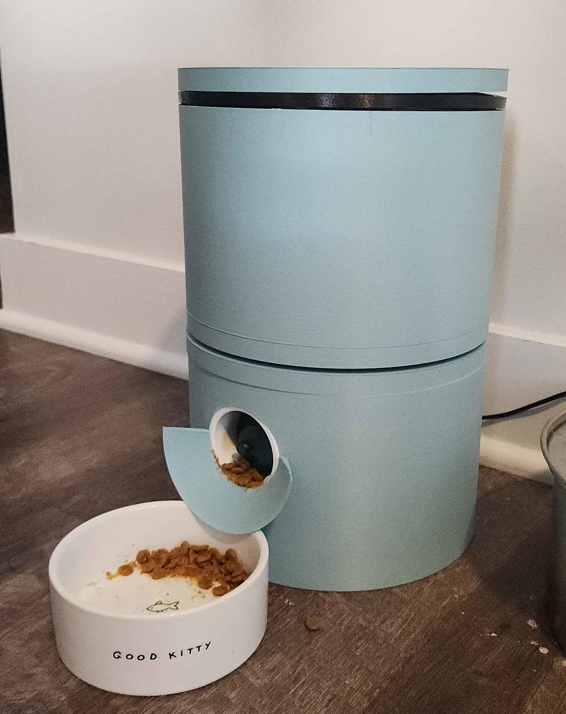
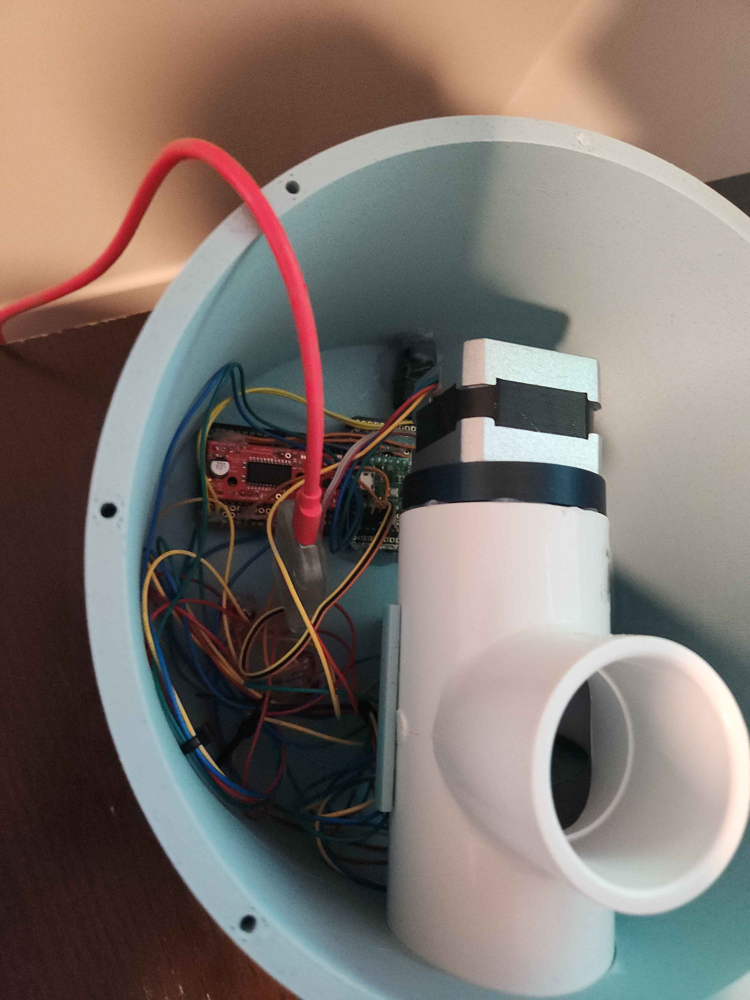
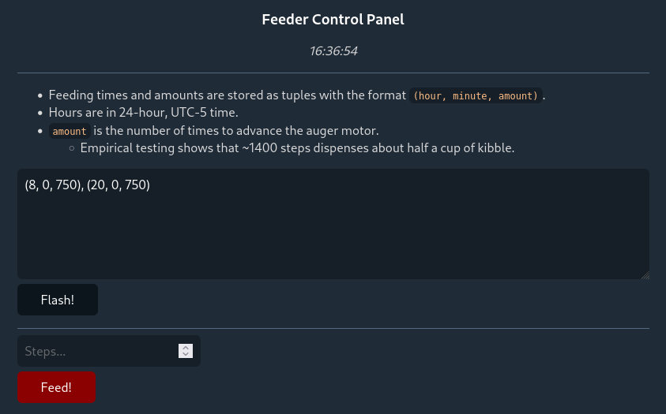

This repository contains the MicroPython source code for my basic automated cat feeder.

Inside is a single NEMA 17 stepper motor (run by a Pico W microcontroller + driver board) attached to a PVC tee. Kibble is gravity fed from the hopper, then (at feeding time) is mechanically dispensed by an auger attached to the stepper.

With the exception of the PVC tube and auger, the entire enclosure was independently modeled and 3D printed. I used PLA with high-durability slicer settings for most components, with a touch of TPU (flexible/rubber-like) used for some ad-hoc gaskets.

The kibble hopper (top half) is detachable, and the interior is lined with Teflon craft sheeting for ease of cleaning.

I took full advantage of the fact that I had the Pico *W* to simplify the engineering required:
- There is no battery-backed real time clock. The current time is simply fetched using NTP at power-on and saved to the Pico's internal RTC.
- There are no on-board controls or display. Configuring the schedule and triggering manual feeds are done using a LAN web interface:

The schedule is stored as an array of three-wide tuples, representing `(hour, minute, amount)`. At power on and updateLET, this is simply `eval`'d into memory.

# Version 2

This all *works*, but that doesn't mean it isn't janky. A few issues off the top of my head:
* Gravity feeding into the dispensing mechanism is spotty at best.
* The auger will almost immediately jam if run linearly; a "200 out/100 in" pattern is needed to work around this.
* WLAN information is hard coded, and power-on blocks on connecting to the Internet and querying remote NTP servers. If (when) the network environment changes, the software is effectively softlocked until I wire up the debug probe and flash an update.
* The circuitry is a mess of hot glue and breadboard jumpers that were never designed to be soldered.

At some point - when I have better CAD skills, primarily - I'd like to make a "version 2" of this project to address these issues. Some software fixes will likely be applied sooner, of course.

- [ ] Design and fabricate a proper PCB for the Pico and driver board. No more jumper hell.
- [ ] Redo the enclosure from the ground up to make it less... aggressively cylindrical, and also expose debug probe connections on the exterior.
- [x] Make the software more robust.
  - [x] Add fallback networks and timeouts.
  - [x] If the network or NTP servers are totally unreachable, fallback onto the default RTC configuration rather than softlocking - this ensures food will only be delayed at *most* 24 hours. (I don't plan to leave my cat alone for multiple days, so I handwaved this concern in the initial implementation.)
- [ ] Re-evaluate the gravity feeding mechanism. An improved hopper (taller, with a symmetrical and steeper angle on the interior cone) with some sort of active agitator (such as a servo-driven rod or a *really* powerful vibrator) is the likely solution.
- [ ] Re-evaluate the auger-driven dispensing mechanism. It'll be *impossible* to fully clean long term, and the "200 out/100 in" cycle only papers over jamming issues and likely leads to inconsistent feeding.
  - [ ] Rather than "pushing" into the auger at the middle, it could be directly inserted into the hopper to pull food up and out. This approach is used by a lot of Arduino-based fish feeders.
  - [ ] Alternately, many of the commercial products on Amazon seem to use a spoked wheel/impeller that spins underneath the hopper exit; food falls into the (presumably portion-sized) areas between the blades and is then rotated "down and out" - similar to a cereal dispenser you might find in a cafeteria.
